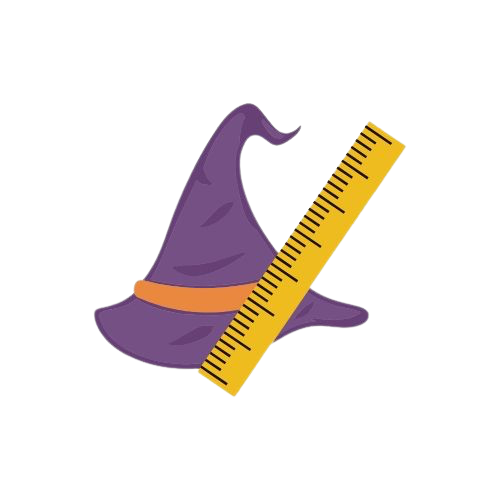

<a name="readme-top">

<br/>

<br />
<div align="center">
  
<!-- TODO: Change Title to the name of the title of your Project -->
  <h3 align="center">Math Wizard</h3>
</div>
<!-- TODO: Make a short description -->
<div align="center">
  This website will feature math lessons, for example addition, subtraction, multiplication, division, and extra knowledge. Additionally, this will display basic PHP programming like declarations, looping, and conditional statements.
</div>

<br />

<!-- TODO: Change the zyx-0314 into your github username  -->
<!-- TODO: Change the WD-Template-Project into the same name of your folder -->


[](https://wakatime.com/badge/user/04412757-f1c1-4ba6-86ec-7b8428992c73/project/a5ea2f3b-db0a-4679-a95a-028196a8a6cd)

---

<br />
<br />

<!-- TODO: If you want to add more layers for your readme -->
<details>
  <summary>Table of Contents</summary>
  <ol>
    <li>
      <a href="#overview">Overview</a>
      <ol>
        <li>
          <a href="#technology">Technology</a>
        </li>
      </ol>
    </li>
    <li>
      <a href="#rule,-practices-and-principles">Rules, Practices and Principles</a>
    </li>
    <li>
      <a href="#resources">Resources</a>
    </li>
  </ol>
</details>

---

## Overview

<!-- TODO: To be changed -->
<!-- The following are just sample -->

In this project, it will feature all basic programming of PHP, it will declare arrays to store the values and computations to be used for display. For loops to loop through the array for easy outputs. Lastly, it will use conditional statements, if else, for the conditional operators.

### Technology

<!-- TODO: List of Technology Used -->
#### Language


## Rules, Practices and Principles

<!-- Do not Change this -->

1. Always use `AD-` in the front of the Title of the Project for the Subject followed by your custom naming.
2. Do not rename `.php` files if they are pages; always use `index.php` as the filename.
3. Add `.component` to the `.php` files if they are components code; example: `footer.component.php`.
4. Add `.util` to the `.php` files if they are utility codes; example: `account.util.php`.
5. Place Files in their respective folders.
6. Different file naming Cases
   | Naming Case | Type of code         | Example                           |
   | ----------- | -------------------- | --------------------------------- |
   | Pascal      | Utility              | Accoun.util.php                   |
   | Camel       | Components and Pages | index.php or footer.component.php |
8. Renaming of Pages folder names are a must, and relates to what it is doing or data it holding.
9. Use proper label in your github commits: `feat`, `fix`, `refactor` and `docs`
10. File Structure to follow below.

```
AD-ProjectName
└─ assets
|   └─ css
|   |   └─ style.css
|   └─ img
|   |   └─ mathbg.webp
|   └─ img
|   |   └─ logo.png
└─ pages
|  └─ lesson
|     └─ assets
|     |  └─ css
|     |  |  └─ style.css
|     |  └─ img
|     |  |  └─ mathbg.webp
|     └─ index.php
|
└─ index.php
└─ readme.md
└─ .gitignore
└─ bootstrap.php
└─ composer.json
└─ composer.lock
└─ router.php


```
> The following should be renamed: name.css, name.js, name.jpeg/.jpg/.webp/.png, name.component.php(but not the part of the `component.php`), Name.utils.php(but not the part of the `utils.php`)

## Resources

<!-- TODO: Add References -->

| Title        | Purpose                                                                       | Link          |
| ------------ | ----------------------------------------------------------------------------- | ------------- |
| Loopings in PHP W3School | descriptions and practice on how loops is programmed and functions in PHP | https://www.w3schools.com/php/php_looping.asp |
